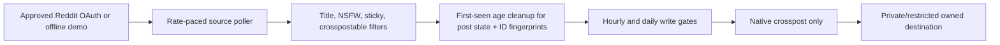
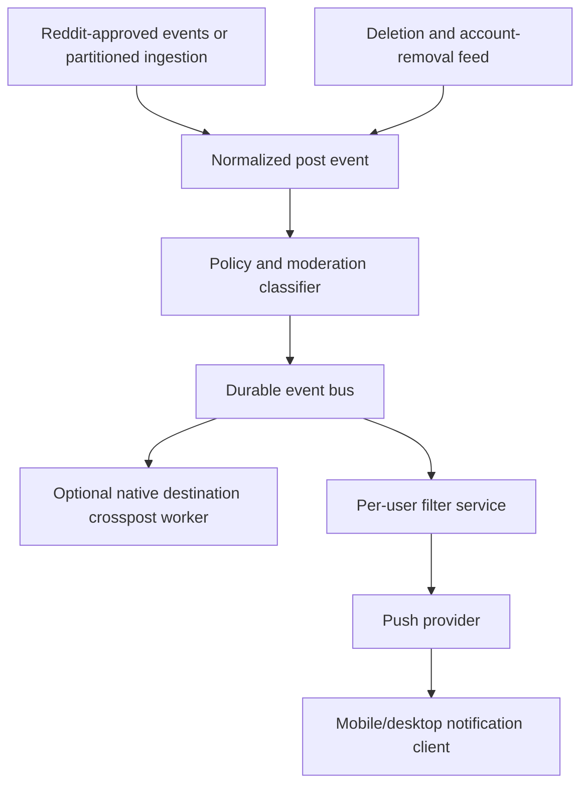

# Architecture and scaling boundary

## Current POC

The WPF process contains:

- `RedditOAuthService`: system-browser authorization, loopback callback, state
  verification, encrypted refresh-token handoff.
- `RedditApiClient`: access-token refresh, authenticated listings, destination
  validation, native submit call, recent-destination reconciliation, and server
  rate-header parsing.
- `RelayEngine`: first-run baseline, creation-time cutoff, deterministic filters,
  oldest-first processing, 80-QPM listing pacing, 15-second write spacing,
  cross-configuration caps, write-ahead submission state, uncertain-response
  reconciliation, server-directed pauses, and stop/close quiescence.
- `StateStore`: atomic JSON state, a non-sliding first-collection retention
  anchor for post records and SHA-256 fingerprints, a persisted global live API
  pause, persisted live-mode last-listing-read and last-submission-attempt
  timestamps, and state namespaces scoped by mode, destination, client, and
  contact identity. Records older than 48 hours are purged on startup/before
  polling; creation cutoffs prevent expired old posts from reappearing.
- `SecretStore`: Windows DPAPI CurrentUser encryption.
- `MainWindow`: explicit demo/dry/live modes, setup gates, controls, activity,
  and links to official setup surfaces.

No scraping or copy fallback exists. A rejected native crosspost becomes a
visible terminal skip. An uncertain response is reconciled against the
destination once; if it is still unconfirmed, the ID becomes terminal manual
review and is never submitted again. A persisted `Retry-After` gate applies
across one-shot actions and restarts. The 80-QPM listing spacing and 15-second
submission spacing use shared live-mode timestamps in the same state file, so a
new relay engine, **Test one crosspost**, or an app restart cannot reset those
pacing windows. Once a write is dispatched, stop/close waits for that bounded
request to settle so an accepted response is not lost.

The desktop process cannot purge while it is closed. Its 48-hour rule is
therefore next-start/next-poll cleanup, not a wall-clock deletion guarantee.

The Windows client currently uses legacy `/api/submit` crosspost fields that are
not documented in Reddit's current public API reference. That path remains
experimental until Reddit approves the client and the owner verifies one write
in a private/restricted destination. The Devvit route uses the documented
`Post.crosspost` API.

## Latency and source-count math

Reddit currently documents 100 Data API queries per minute per approved OAuth
client ID, averaged over ten minutes. The client paces listing reads to at most
80/minute so token, validation, reconciliation, and write calls have headroom.

Approximate minimum read time before network latency:

| Sources | Minimum sweep time at 80 listing reads/min | Practical meaning |
|---:|---:|---|
| 2 | 1.5 seconds | A 30-second between-sweep delay dominates |
| 25 | 19 seconds | Near-real-time-ish POC |
| 100 | 75 seconds | Freshness is already minute-scale |
| 500 | 6.25 minutes | Supported as a controlled experiment, not real time |
| 2,000 | 25 minutes | Not a viable desktop polling architecture |

The between-sweep interval is added after a full sweep. Listing endpoints can
also return only a bounded window, so high-volume sources can still outrun a
poller. The public rate allowance is not a posting allowance; Reddit publishes
no dependable safe automated-post volume, and spam rules still apply.

Therefore, “all posts from 2,000 communities in real time” is not a larger
configuration value. It requires written Reddit agreement and a different
ingestion mechanism.

## Production direction after Reddit approval

Key changes:

1. Obtain explicit API and commercial approval before monetization or broad
   distribution.
2. Ask Reddit for an approved event/feed path; if unavailable, negotiate a
   bounded sharded polling budget. Do not multiply OAuth clients to evade limits.
3. Partition by source, use cursors and a durable queue, and reconcile bounded
   listing windows.
4. Add source-community consent/objection handling, destination moderation,
   takedowns, NSFW controls, copyright response, and deletion propagation.
5. Treat native destination crossposts as a presentation surface, not the
   notification database. The push layer should consume normalized events.
6. Give each user source, keyword, post-type, NSFW, language, quiet-hour, and
   frequency filters before push delivery.

## Business assessment

The defensible opportunity is not “copy all of Reddit into one subreddit.” That
creates moderation load, spam risk, poor ranking, and a hard platform dependency.
The stronger product is an opt-in discovery/notification layer with:

- topic packs curated with moderators;
- native attribution back to source communities;
- granular per-user filters and digest controls;
- high-quality deduplication and deletion propagation;
- measurable incremental discovery for source communities;
- a Reddit-approved commercial/data agreement.

The Devvit playtest proves on-platform mechanics. The Windows client proves an
operator control plane. Neither by itself proves the 2,000-source business.
